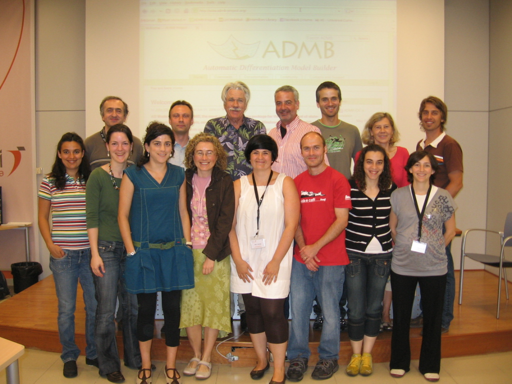

AZTI Tecnalia, San Sebastian, July 6-7, 2009.
=============================================

Instructors: Anders Nielsen, John Sibert

[Welcome and Introduction (pdf)](course-intro.pdf)

[Why “AD” in ADModel Builder (pdf)](autodif-intro.pdf)

[Estimating and Expressing Uncertainty (pdf)](uncertainty.pdf)

[Maximum likelihood estimation (pdf)](MaximumLikelihood.pdf)

[Specifying model parameters (pdf)](Parameters.pdf)

[Data input and reporting results (pdf)](DataInOut.pdf)

[MCMC in AD Model Builder (pdf)](MCMCinADMB.pdf)

[Random effects models (pdf)](RandomEffects.pdf)

