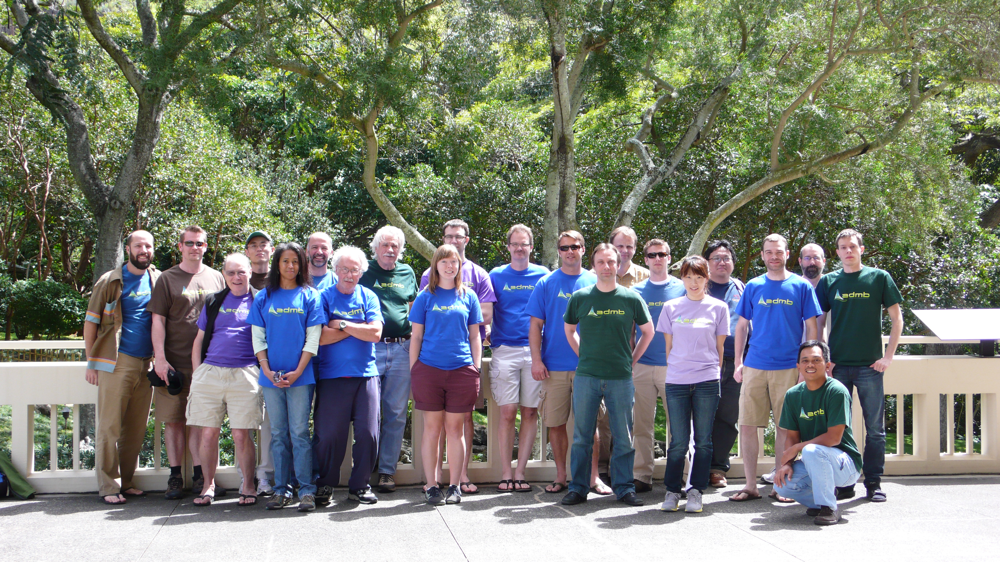

ADMB Developers' Workshop, University of Hawaii, March 13-16, 2012
------------------------------------------------------------------

[March 2012 Developer Workshop Report](March2012DevelopersWorkshopReport.pdf)

[Factors in admb?](anielsen.pdf)

[gdb-refcard.pdf](gdb-refcard.pdf)
: GDB reference card

[gource.mp4](gource.mp4)
: Video showing commits during workshop

[Open MPI Presentation](mpi_pres.pdf)
: Presentation about the parallelization efforts.

[Parallelization in ADMB](openmpi.pdf)
: Short writeup on how to enable parallelization with select models in ADMB

[Simple Makefile for ADMB](simple-makefile-for-admb)
: Tested with gnu make under 64bit linux. Some modifications required for other configurations. Steve added contributed libraries to path.

[Spatial models in ADMB](spatial_honolulu.pdf)

[Trapping floating point errors](trapping-floating-point-errors)
: Dave's simple additions to a TPL file to trap floating point errors

[Contributed Libraries](ContribLib.pdf)
: A short presentation on how to use Contributed Libraries in ADMB

