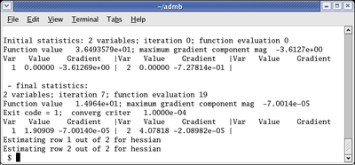

<h2>ADMB Installation Linux</h2>

Shows the procedure to install, build and run ADMB in Linux.
This installation procedure is outdated, but available for reference.  Please see downloads for the most current install documentation.

**Introduction**

Linux uses the GNU open source compiler gcc.  This compiler can be used to build ADMB programs.  Below shows the procedure to install and configure ADMB in Linux.

Note: a bit more information is also available in the brief Using ADMB on linux tutorial.

**Procedure**

1. Download and extract ADMB Linux binaries from downloads tab of this website.

2. Open a bash shell, change to extracted Linux ADMB Home directory, then type the following commands .

   ```
   #Change to ADMB folder.
   $ cd ~/admb
   # Sets ADMB Home directory.
   $ export ADMB_HOME=~/admb 
   # Adds ADMB bin to $PATH
   $ export PATH=$ADMB_HOME/bin:$PATH 
   ```

3. Change into ADMB Home directory, then run examples for verification.

   ```
   $ cd $ADMB_HOME
   $ chmod -R u+w examples
   $ cd examples
   $ make
   ```

4. The screen shot output.

   
