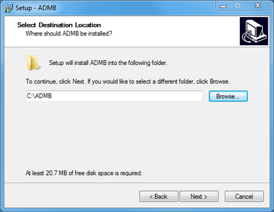
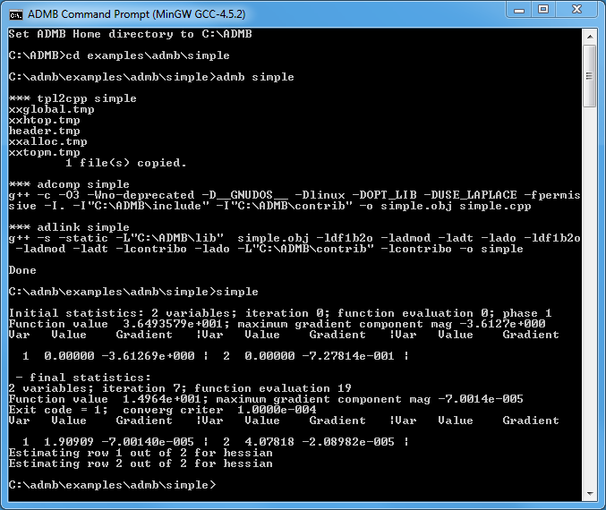

<h2>ADMB Installation Windows GCC</h2>

Shows the procedure to install, build and run ADMB with GCC.

**Introduction**

The Windows GCC version of ADMB works with an open source GNU Compiler Collection (GCC) implemented in Windows using a software port called MinGW.  Follow the procedure to install and build ADMB programs.

Note: the AD Studio (integrated development environment) installs GCC along with ADMB and therefore may be an easier place for new users to start.

**Procedure**

1. Download the 32-bit version of GCC version 4.5.2 from the gcc page and unzip the file into a C:\MinGW\.
   _Note: a version of ADMB for Windows with 64 bit GCC is coming soon._
2. Edit your PATH environmental variable to include the location where you put GCC. In Windows 7 this can be done as follows:
   * Right-click on "My Computer" and click "Properties".
   * Click the "Advanced System Settings" link in the left column.
   * In the "System Properties" window click the "Environment Variables" button.
   * Highlight the "Path" variable in the Systems Variable section and click "Edit" 
   * Add the location from step 1 to the existing path, separated by a semi-colon.
3. Download ADMB for Windows GCC from the downloads tab of this website.
4. Double click the installer and follow the instructions. If you have administrative privileges, the default installation in Program Files should be fine. <br/>If you DO NOT have administrative privileges, choose a location like c:\ADMB. This might be preferable regardless.

   

5. If you chose a location other than C:\MinGW\ to unzip the GCC files, you need to edit the file c:\ADMB\bin\set-admb-mingw.bat and change the MINGW_HOME setting to match the location you chose.
6. Once the installer is Finished, open the ADMB Command Prompt located in Start->All Programs->ADMB (MinGW GCC-4.5.2)->ADMB Command Prompt (MinGW GCC-4.5.2)
7. In the Command prompt, type the command below to build and run the simple example.

   ```
   c:\ADMB> cd examples\admb\simple
   c:\ADMB\examples\admb\simple> admb simple
   c:\ADMB\examples\admb\simple> simple
   ```

   If those commands give output like that shown in the screenshot below, your installation is a success.

   
