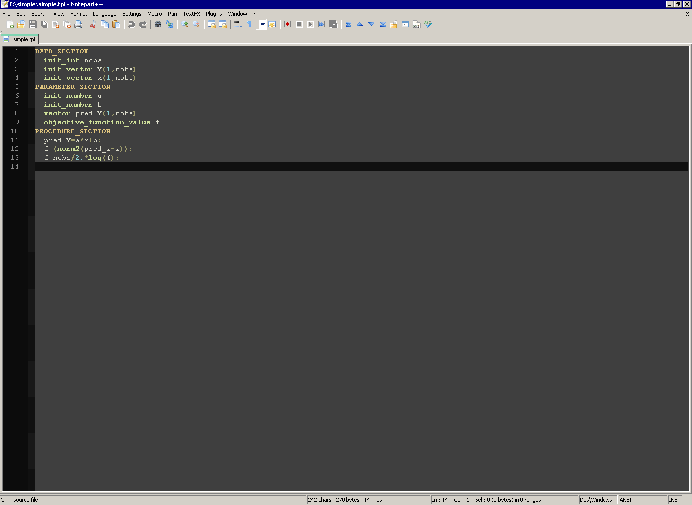

Notepad++
---------

Ignore the silly name, [Notepad++](https://notepad-plus-plus.org/) is a decent free editor for Windows.

Lightweight and not requiring administrator privileges to unzip and use, it can be seen as the successor of PFE (Programmer's File Editor) and Crimson, which are no longer maintained.

Teresa A'mar (NOAA, Seattle) has contributed a collection of XML files providing [ADMB support](npp.zip) in Notepad++.

Screenshot

