ADMB t-shirts page
------------------

  
<b>Pictures of ADMB users wearing ADMB T-shirts</b> 

The ADMB Foundation will provide a T-shirts to anyone who promises to wear it at a conference <b>(see <a title="" href="Tshirts.pdf" class="wiki internal-link" target="_self">colours and sizes</a>)</b>. Photos appreciated.

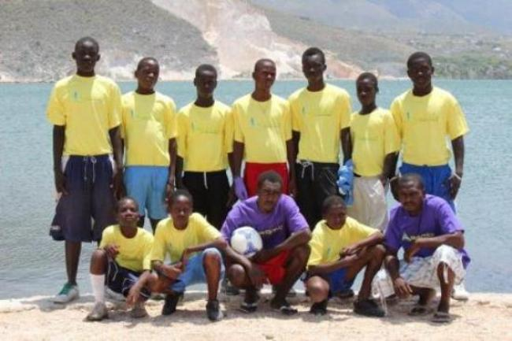

The "FACE A FACE" de Fond Bayard soccer team in Haiti wearing their ADMB T-shirts. Fond Bayard is a small village inhabited by former Braceros (Haitian working in Sugar cane plantations of the Dominican Republic) located on the South east coastline of Etang Saumatre (a.k.a. lake Azuei) close to the border of Haiti and Dominican republic.

 

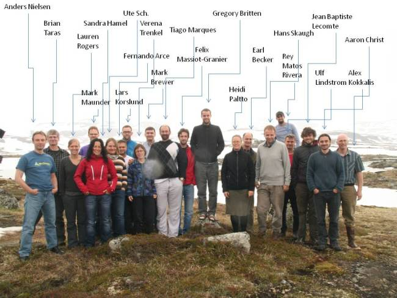

ADMB course, ISEC2012 conference, Finse, Norway 2012.

 

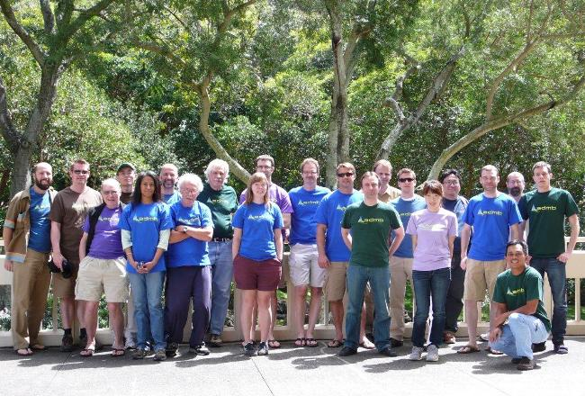

ADMB developers at the ADMB Developers Workshop, Hawaii, 2012.

 

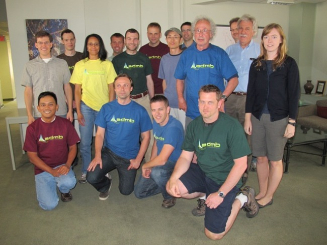

ADMB developers at the ADMB Developers Workshop, NCEAS, Santa Barbara, 2011.

 

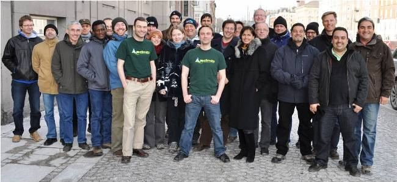

ADMB workshop taught by <a class="wiki" href="http://nielsensweb.org/anders/">Anders Nielsen</a> and Arni Magnusson at ICES, Copenhagen, 2011 (<a class="wiki" href="http://ices.dk/iceswork/training/Reports/TCADSAM11.pdf">course details</a>).

 

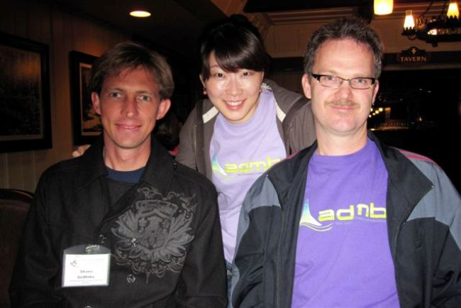

Shane Griffiths, Eunjung Kim, and <a class="wiki" href="http://www.fisheriesstockassessment.com/TikiWiki/tiki-index.php?page=Mark+Maunder">Mark Maunder</a> at the Tuna Conference, Lake Arrowhead, 2011.

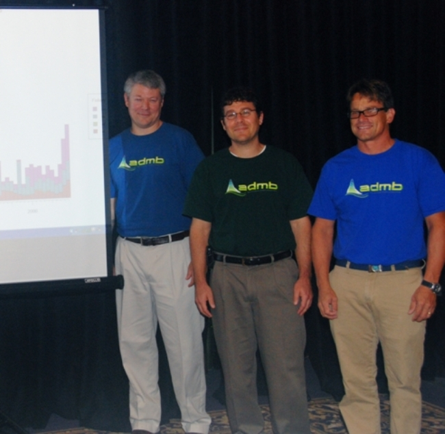

<a class="wiki" href="http://www.uaex.edu/aquaculture/whitecoats/stock%20assessment%20biologist.html">Erik Williams</a>, Kyle Shertzer, and Rob Cheshire at a stock assessment review meeting in Savannah, GA.

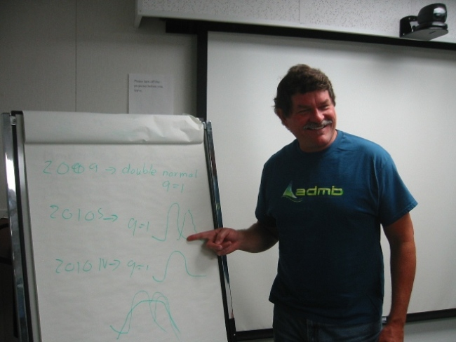

<a class="wiki" href="http://swfsc.noaa.gov/staff.aspx?id=610">Kevin Hill</a> explaining his model at the sardine stock assessment meeting.

 

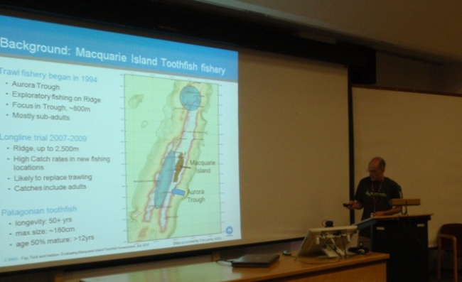

<a class="wiki" href="https://fish.uw.edu/research/MPAM/Fay.htm">Gavin Fay</a> giving his presentation at the International Statistical Ecology Conference, University of Kent, Canterbury, UK, on 5 July 2010.

 

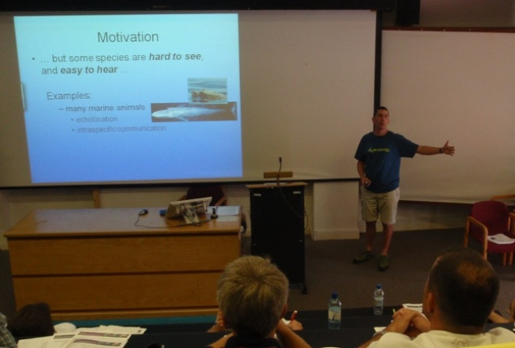

<a class="wiki" href="http://www.creem.st-and.ac.uk/len/">Len Thomas</a>, who does not use ADMB but wanted a free T-shirt, giving his presentation at the International Statistical Ecology Conference, University of Kent, Canterbury, UK, on 5 July 2010.

 

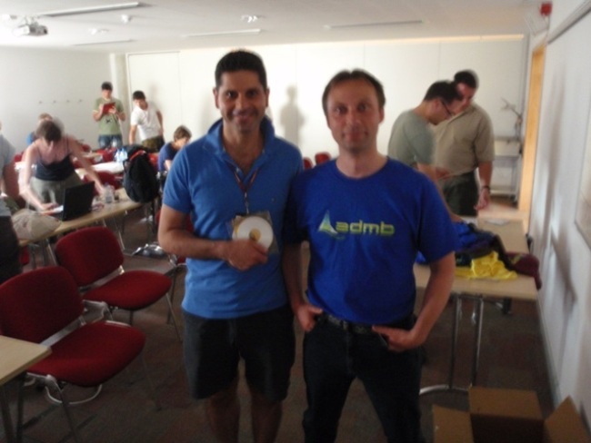

Student Takis Besbeas and instructor <a class="wiki" href="http://nielsensweb.org/anders/">Anders Nielsen</a> at an ADMB course held at the International Statistical Ecology Conference, University of Kent, Canterbury, UK, on 5 July 2010.

 

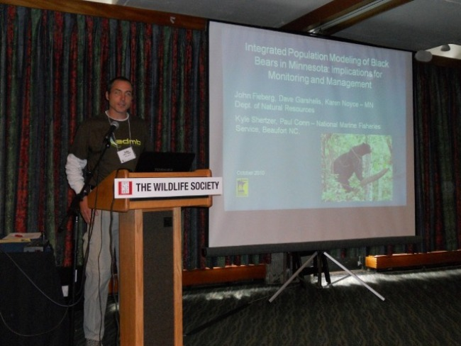

<a class="wiki" href="http://fwcb.cfans.umn.edu/personnel/john-fieberg">John Fieberg</a> of Minnesota Department of Natural Resources at the Wildlife Society conference in Snowbird, UT, giving his presentation "Integrated population modeling of black bears in Minnesota: Implications for monitoring and management."

 

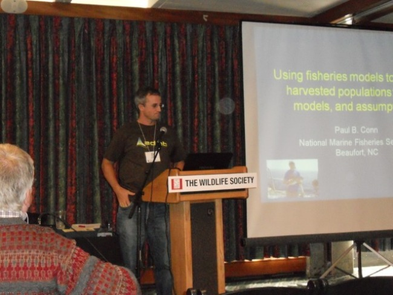

Paul Conn of NOAA at the Wildlife Society conference in Snowbird, UT, giving his presentation "Using fisheries models to assess harvested populations: a review of data, models, and assumptions."

 

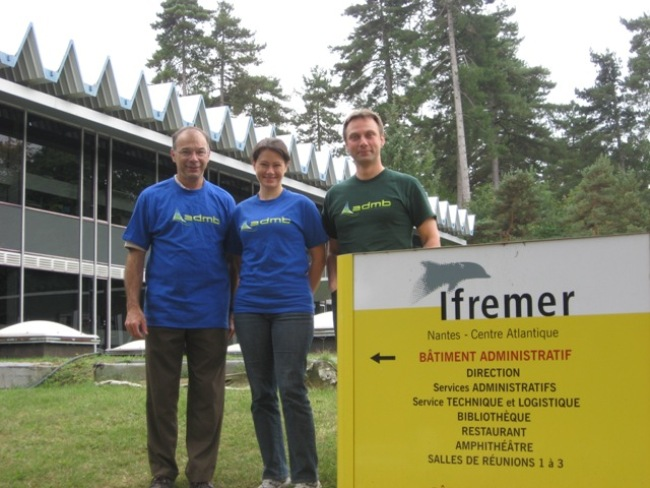

Richard Methot, <a class="wiki" href="https://www.nwfsc.noaa.gov/research/staff/display_staffprofile.cfm?staffid=612">Melissa Haltuch</a>, and <a class="wiki" href="http://nielsensweb.org/anders/">Anders Nielsen</a> at the ICES Workshop on Reviews of Recent Advances in Stock Assessment Models Worldwide at IFREMER, Nantes, France, 27 September to 1 October 2010.

 

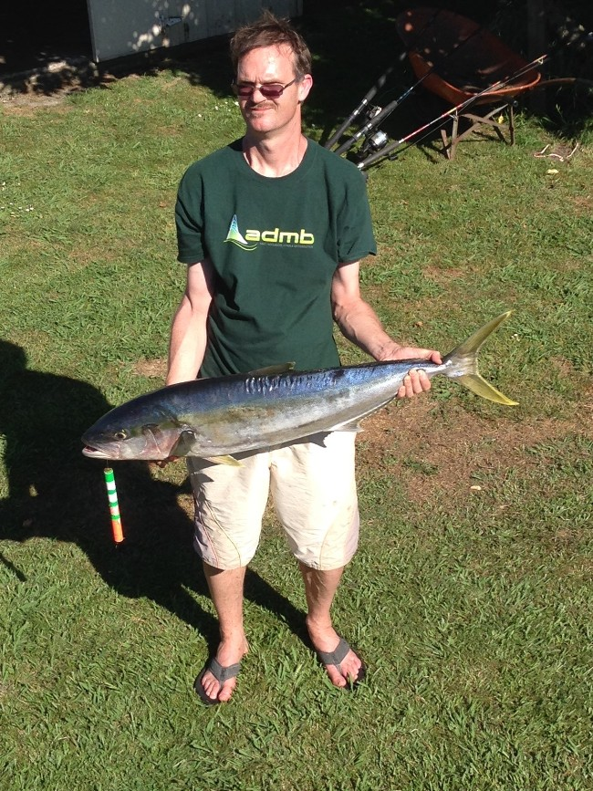

Ex ADMB Foundation president Mark Maunder with yet another Kingfish (yellowtail) caught in New Zealand. 

 

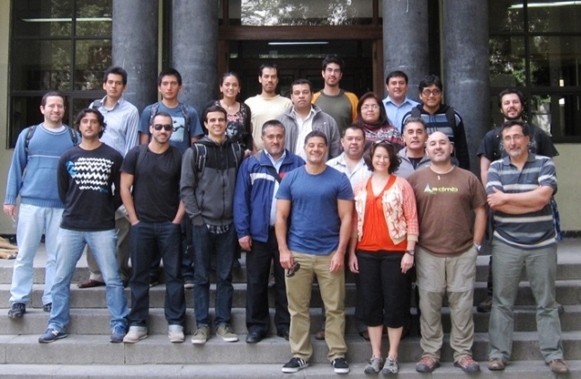

Melissa Haltuch, <a class="external-link" href="http://www.capamresearch.org/research-scientists/Valero" target="_self" title="">Juan Valero</a>, Billy Ernst and participants from the <a class="external-link" href="http://www.capamresearch.org/content/stock-assessment-course-chile" target="_self" title="">Stock Assessment course</a> taught in the Universidad de Concepcion, Chile during March 3-7, 2014.

